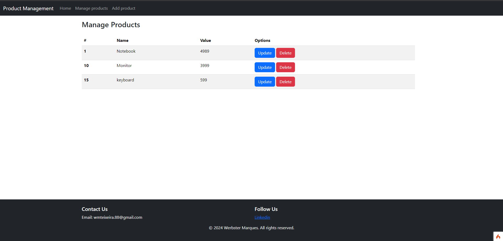

# Product Management System

Welcome to the Product Management System! This application allows you to efficiently manage products with CRUD (Create, Read, Update, Delete) operations.

## Features

- **Create:** Add new products to the system.
- **Read:** View a list of all products and their details.
- **Update:** Modify existing product information.
- **Delete:** Remove products from the system.

## Getting Started

Follow these instructions to get the application up and running on your local machine.

### Prerequisites

- PHP 7.2 or higher
- Composer
- MySQL/MariaDB

### Installation

1. Clone the repository:

   ```
   git clone https://github.com/yourusername/product-management-system.git
    ```

2. Navigate to the project directory:
    ```
    cd product-management-system
    ```

3. Install dependencies:
    ```
    composer install
    ```

4. Configure your environment variables by the .env file with your database settings.

5. Start the development server:
     ```
    php spark serve
    ```

7. Access the application in your web browser at http://localhost:8080

### Usage
* Navigate to the homepage to get started with managing products.
* Use the provided UI to perform CRUD operations on products.

### Home Page
Primary landing page with essential information and navigation.


### Manage Products
Comprehensive view and management of existing products.


### Add Product
Convenient interface for inputting new product information.


### Contributing
Contributions are welcome! If you find any bugs or have suggestions for improvement, feel free to open an issue or submit a pull request.

### License 
This project is licensed under the MIT License - see the [LICENSE](LICENSE) file for details.